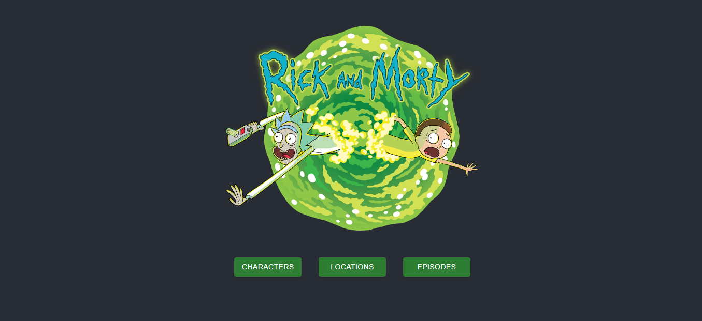

# Rick and Morty App

## Descripción

Rick and Morty App es una aplicación web que permite visualizar información sobre la serie animada Rick and Morty. La aplicación fue desarrollada utilizando React y Material-UI.



## Demo

Podes acceder a la aplicación en el siguiente enlace: [Rick and Morty App](https://rick-and-morty-series-app.netlify.app/)

## Funcionalidades

- Lista de personajes: Muestra la lista de personajes de la serie. Permite buscar personajes por nombre y filtrarlos por estado, género y especie. Al hacer clic en el botón de más información se muestra la información detallada del mismo.
- Lista de ubicaciones: Muestra la lista de ubicaciones de la serie. Permite visualizar la cantidad de residentes de cada ubicación y sus respectivas imagenes.
- Lista de episodios: Muestra la lista de episodios de la serie.
- Paginación: Permite navegar entre las diferentes páginas de personajes, ubicaciones y episodios.
- Navegación: Permite navegar entre las diferentes rutas de la aplicación.
- Responsive: La aplicación se adapta a diferentes tamaños de pantalla.

## Tecnologías utilizadas

- React: Biblioteca de JavaScript utilizada para la creación de interfaces de usuario.
- Material-UI (MUI): Biblioteca de componentes de interfaz de usuario que proporciona estilos y elementos de diseño predefinidos para una apariencia visual agradable y coherente.
- HTML/CSS: Utilizados para estructurar y estilizar la aplicación.
- Fetch API: Utilizada para realizar solicitudes a una API externa y obtener los datos de episodios, personajes y ubicaciones. La API utilizada es [Rick and Morty API](https://rickandmortyapi.com/).
- React Router: Biblioteca utilizada para la navegación entre diferentes rutas de la aplicación.
- JavaScript ES6: Utilizado para la lógica de la aplicación.
- Git: Sistema de control de versiones utilizado para el seguimiento y gestión de cambios en el código fuente.

## Instalación

1. Clona este repositorio en tu máquina local:

   ```
   git clone https://github.com/tu-usuario/rick-and-morty-app.git
   ```

2. Accede al directorio del proyecto:

   ```
   cd rick-and-morty-app
   ```

3. Instala las dependencias:

   ```
   npm install
   ```

4. Inicia la aplicación:

   ```
   npm start
   ```

5. Abre tu navegador web y accede a la siguiente URL: [http://localhost:3000](http://localhost:3000)

---
